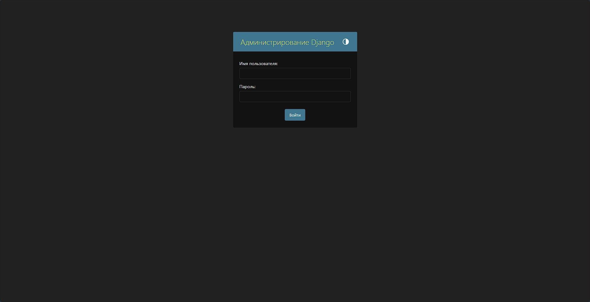

<div align="center">

# 💰 CashFlow Manager

[](https://www.djangoproject.com/)
[](https://www.python.org/)
[](https://getbootstrap.com/)
[](https://www.sqlite.org/)
[](LICENSE)

> A comprehensive web application for managing cash flow operations with advanced filtering, categorization, and financial tracking capabilities.

</div>

---

## 🌟 Features

### 📊 Core Functionality
- **✨ Create Cash Flow Records** with date, status, type, category, subcategory, amount, and comments
- **📋 View All Records** in a paginated table with sorting capabilities
- **🔍 Advanced Filtering** by date range, status, type, category, and subcategory
- **✏️ Edit & Delete** existing records with **clear action buttons** (icons + descriptive text)
- **⚙️ Reference Management** for statuses, types, categories, and subcategories

### 🔗 Business Logic & Data Integrity
- **Hierarchical Categories**: Subcategories linked to categories
- **Type-Based Categories**: Categories tied to operation types (Income/Expense)
- **Complete Subcategory Coverage**: **73 subcategories** across **20 categories** (all categories have subcategories)
- **Validation Rules**: Prevents incompatible combinations
- **Dynamic Dropdowns**: AJAX-powered category/subcategory filtering

### ✅ Enhanced Data Validation
- **Required Fields**: Amount, type, category, subcategory validation
- **Client & Server Validation**: Both frontend and backend checks
- **Business Rules**: Logical dependency validation
- **Form Validation**: Real-time validation with error messages
- **CSRF Protection**: Secure form submissions

## 🛠 Technology Stack

<div align="center">

| Component | Technology | Version |
|-----------|------------|---------|
| **Backend** | Django | 5.2.6 |
| **API** | Django REST Framework | 3.16.1 |
| **Database** | SQLite | 3.x |
| **Frontend** | Bootstrap | 5.3 |
| **Language** | Python | 3.8+ |
| **JavaScript** | Vanilla JS | ES6+ |

</div>

## 📸 Screenshots

<div align="center">

### 🏠 Main Dashboard


### ➕ Create New Record


### 📝 Record Management


### ⚙️ Reference Data Management


### 🔐 Admin Panel


</div>

## 🚀 Complete Installation Guide

### 📋 System Requirements

**Minimum Requirements:**
- **Operating System**: Windows 10/11, macOS 10.14+, Linux (Ubuntu 18.04+)
- **Python**: 3.8, 3.9, 3.10, or 3.11
- **RAM**: 512 MB minimum, 1 GB+ recommended
- **Disk Space**: 200 MB free space
- **Internet**: Required for dependency installation

### 1️⃣ Project Setup

#### 1.1 Download Project
```bash
# If you have a repository:
git clone <repository-url>
cd cashflow-project

# Or download ZIP archive and extract it
# Then open command prompt in the project folder
```

#### 1.2 Verify Python Installation
```bash
python --version
# Should output: Python 3.8.0 or higher

python -m pip --version
# Should output pip version
```

### 2️⃣ Virtual Environment Setup

#### 2.1 Windows
```bash
# Create virtual environment
python -m venv venv

# Activate virtual environment
venv\Scripts\activate

# Verify activation (should show (venv) prefix)
echo %VIRTUAL_ENV%
```

#### 2.2 macOS/Linux
```bash
# Create virtual environment
python -m venv venv

# Activate virtual environment
source venv/bin/activate

# Verify activation (should show (venv) prefix)
echo $VIRTUAL_ENV
```

### 3️⃣ Dependencies Installation

#### 3.1 Upgrade pip (Recommended)
```bash
python -m pip install --upgrade pip
```

#### 3.2 Install Packages from requirements.txt
```bash
pip install -r requirements.txt
```

**If you encounter installation errors:**

**Django Error:**
```bash
pip install Django==5.2.6
```

**Django REST Framework Error:**
```bash
pip install djangorestframework==3.16.1
```

**Django CORS Headers Error:**
```bash
pip install django-cors-headers==4.9.0
```

**Manual Installation of All Dependencies:**
```bash
pip install Django==5.2.6 djangorestframework==3.16.1 django-cors-headers==4.9.0 python-dateutil==2.9.0
```

### 4️⃣ Database Configuration

#### 4.1 Apply Migrations
```bash
python manage.py migrate
```

**What this command does:**
- Creates tables in SQLite database
- Sets up Django built-in apps (auth, admin, sessions, etc.)
- Creates tables for cashflow app (statuses, types, categories, subcategories, records)

**If you encounter an error:**
```bash
# Delete database file and try again
del db.sqlite3
python manage.py migrate
```

#### 4.2 Check Migration Status
```bash
python manage.py showmigrations
# All migrations should be marked with [X]
```

### 5️⃣ Create Administrator Account

#### 5.1 Automatic Admin Creation
```bash
python manage.py shell -c "
import os
os.environ.setdefault('DJANGO_SETTINGS_MODULE', 'cashflow_project.settings')
import django
django.setup()

from django.contrib.auth import get_user_model
User = get_user_model()

if not User.objects.filter(username='admin').exists():
    User.objects.create_superuser('admin', 'admin@example.com', 'admin123')
    print('✅ Administrator created!')
else:
    print('ℹ️ Administrator already exists')
"
```

#### 5.2 Manual Admin Creation (Alternative)
```bash
python manage.py createsuperuser
# Enter:
# Username: admin
# Email: admin@example.com
# Password: admin123
# Password (again): admin123
```

### 6️⃣ Populate Initial Data

#### 6.1 Fill Reference Data
```bash
python manage.py populate_initial_data
```

**What gets created:**
- **Statuses**: Business, Personal, Tax
- **Operation Types**: Income, Expense
- **Income Categories**: Salary, Freelance, Investments, Sales, Gifts
- **Expense Categories**: Food, Transport, Housing, Entertainment, Health, Clothing, Electronics, Education, Travel, Car, Beauty, Communication, Pets, Gifts, Charity
- **Subcategories**: 70+ subcategories for all categories

#### 6.2 Add Missing Subcategories
```bash
python manage.py add_missing_subcategories
```

### 7️⃣ Start Development Server

#### 7.1 Launch Server
```bash
python manage.py runserver
```

**Expected Output:**
```
Watching for file changes with StatReloader
Performing system checks...

System check identified no issues (0 silenced).
September 26, 2025 - XX:XX:XX
Django version 5.2.6, using settings 'cashflow_project.settings'
Starting development server at http://127.0.0.1:8000/
Quit the server with CTRL-BREAK.
```

#### 7.2 Open Application
Open your browser and navigate to:
**http://127.0.0.1:8000/**

### 8️⃣ Admin Panel Access

#### 8.1 Admin Panel URL
**http://127.0.0.1:8000/admin/**

#### 8.2 Administrator Credentials
```
Username: admin
Password: admin123
Email: admin@example.com
```

**If you forgot your password:**
```bash
python manage.py shell -c "
from django.contrib.auth import get_user_model
User = get_user_model()
user = User.objects.get(username='admin')
user.set_password('newpassword123')
user.save()
print('New password set!')
"
```

## 📁 Project Structure

```
cashflow_project/
├── cashflow/                    # Main application
│   ├── __init__.py            # Package initialization
│   ├── admin.py               # Django admin configuration
│   ├── apps.py                # Application configuration
│   ├── forms.py               # Django forms with validation
│   ├── models.py              # Database models (5 models)
│   ├── tests.py               # Unit tests
│   ├── urls.py                # URL routing
│   ├── views.py               # View logic and API endpoints
│   ├── management/            # Custom Django management commands
│   │   ├── __init__.py        # Package initialization
│   │   └── commands/          # Management command files
│   │       ├── __init__.py    # Commands package init
│   │       ├── populate_initial_data.py    # Populate reference data
│   │       └── add_missing_subcategories.py # Add subcategories
│   ├── migrations/            # Database migrations
│   │   ├── 0001_initial.py    # Initial database schema
│   │   └── __init__.py        # Migrations package init
│   └── templates/             # HTML templates
│       └── cashflow/
│           ├── base.html      # Base template with Bootstrap
│           ├── index.html     # Main dashboard with filtering
│           ├── record_form.html # Create/edit record forms
│           ├── record_confirm_delete.html # Delete confirmation
│           └── reference_data.html # Reference data management
├── cashflow_project/          # Django project settings
│   ├── __init__.py            # Project package initialization
│   ├── asgi.py                # ASGI configuration
│   ├── settings.py            # Main settings and configuration
│   ├── urls.py                # Main URL routing
│   └── wsgi.py                # WSGI configuration
├── preview/                   # Screenshots and demo images
│   ├── admin-panel.png        # Admin panel screenshot
│   ├── create.png             # Create record form
│   ├── create-home.png        # Record management interface
│   ├── home.png               # Main dashboard screenshot
│   └── reference.png          # Reference data interface
├── .gitignore                 # Git ignore rules
├── LICENSE                    # Custom bilingual license (RU/EN)
├── README.md                  # Comprehensive documentation
├── db.sqlite3                 # SQLite database
├── manage.py                  # Django management script
└── requirements.txt           # Python dependencies
```

## 🎯 Usage

### Creating Cash Flow Records

1. Navigate to the main page
2. Click "Add Record"
3. Fill out the form:
   - Select operation date
   - Specify status (Business/Personal/Tax)
   - Choose type (Income/Expense)
   - Select category (depends on type)
   - Select subcategory (depends on category)
   - Enter amount
   - Add comment (optional)
4. Click "Create"

### Filtering Records

Use filters on the main page:
- **Date Range**: specify period "from" and "to"
- **Status**: select specific status or leave "All statuses"
- **Type**: select operation type or leave "All types"
- **Category**: select category or leave "All categories"
- **Subcategory**: select subcategory or leave "All subcategories"

### Managing Reference Data

1. Go to "Reference Data" section
2. Use "Add" buttons to create new elements
3. Click edit buttons to modify existing items
4. **Important**: create elements in correct order:
   - First operation types
   - Then categories for each type
   - After that subcategories for categories
   - Finally statuses

## 🔧 API Endpoints

The application provides AJAX endpoints for dynamic filtering:

- `GET /api/categories-by-type/?type_id={id}` - get categories by type
- `GET /api/subcategories-by-category/?category_id={id}` - get subcategories by category

## 👤 Admin Panel

Full data access through Django admin:
- URL: `/admin/`
- Use superuser credentials

## 🗄 Database Models

### CashFlowRecord (Cash Flow Records)
- `date` - operation date
- `status` - status (link to Status)
- `type` - operation type (link to Type)
- `category` - category (link to Category)
- `subcategory` - subcategory (link to Subcategory)
- `amount` - amount (DecimalField)
- `comment` - comment (TextField)
- `created_at` - record creation date
- `updated_at` - last modification date

### Status (Statuses)
- `name` - status name
- `description` - description
- `created_at` - creation date
- `updated_at` - modification date

### Type (Operation Types)
- `name` - type name
- `description` - description
- `created_at` - creation date
- `updated_at` - modification date

### Category (Categories)
- `name` - category name
- `type` - operation type (link to Type)
- `description` - description
- `created_at` - creation date
- `updated_at` - modification date

### Subcategory (Subcategories)
- `name` - subcategory name
- `category` - category (link to Category)
- `description` - description
- `created_at` - creation date
- `updated_at` - modification date

## 🔒 Security

- CSRF protection on all forms
- Client and server-side data validation
- Protected deletions with confirmation dialogs
- SQL injection prevention via Django ORM

## 🚀 Deployment

### Production Configuration

1. Change `DEBUG = False` in `settings.py`
2. Configure `ALLOWED_HOSTS`
3. Use PostgreSQL instead of SQLite:
   ```python
   DATABASES = {
       'default': {
           'ENGINE': 'django.db.backends.postgresql',
           'NAME': 'your_db_name',
           'USER': 'your_db_user',
           'PASSWORD': 'your_db_password',
           'HOST': 'localhost',
           'PORT': '5432',
       }
   }
   ```
4. Configure static files:
   ```bash
   python manage.py collectstatic
   ```
5. Use WSGI server (Gunicorn + Nginx)

## 🤝 Development

### Adding New Features

1. Create migrations: `python manage.py makemigrations`
2. Apply migrations: `python manage.py migrate`
3. Update models in `admin.py` if needed
4. Create/update views in `views.py`
5. Create/update forms in `forms.py`
6. Update URL routes in `urls.py`
7. Create/update templates in `templates/`

### Testing

```bash
# Run tests
python manage.py test

# Check code coverage
coverage run --source='.' manage.py test
coverage report
```

## 📝 License

This project is created for educational purposes and includes a **custom bilingual license** (Russian/English) that:
- ✅ Allows personal and educational use
- ✅ Permits non-commercial projects
- ❌ **Prohibits commercial use** without permission
- ❌ **Prevents authorship appropriation**
- 🛡️ **Provides legal protection** for the author

See [LICENSE](LICENSE) file for complete terms.

## 🔄 Recent Improvements & Updates

### ✨ **Enhanced User Experience**
- **Clear Action Buttons**: All edit/delete buttons now show both icons and descriptive text ("Изменить", "Удалить")
- **Complete Subcategory Coverage**: Added **43 additional subcategories** ensuring all 20 categories have relevant subcategories
- **Dynamic Form Validation**: Real-time validation with helpful error messages
- **Responsive Design**: Improved mobile and tablet compatibility

### 🛠 **Technical Enhancements**
- **Comprehensive .gitignore**: Excludes Python cache, IDE files, OS files, and project-specific files
- **Custom Management Commands**:
  - `populate_initial_data` - Creates 55+ reference data entries
  - `add_missing_subcategories` - Ensures complete subcategory coverage
- **Bilingual License**: Russian and English versions with legal protection
- **GitHub Ready**: Properly configured for version control and collaboration

### 📊 **Database Statistics**
- **5 Models** with proper relationships and constraints
- **73 Subcategories** across 20 categories (100% coverage)
- **3 Statuses**: Business, Personal, Tax
- **2 Operation Types**: Income, Expense
- **20 Categories**: 10 income + 10 expense categories
- **Complete Migration System**: Ready for production deployment

### 🔧 **Development Features**
- **AJAX Integration**: Dynamic dropdown filtering without page reloads
- **Form Validation**: Client and server-side validation with business rules
- **CSRF Protection**: Secure form submissions
- **Error Handling**: Comprehensive error messages and validation
- **Admin Integration**: Full Django admin panel support

## 🆘 Support

If you encounter issues:
1. Check server logs
2. Ensure all dependencies are installed
3. Verify database configuration
4. Refer to Django documentation
5. Check the [LICENSE](LICENSE) for usage restrictions

## 🤝 Contributing

1. Fork the repository
2. Create a feature branch
3. Make your changes
4. Add tests if applicable
5. Submit a pull request

## 📞 Contact

For questions about commercial use or licensing, please refer to the [LICENSE](LICENSE) file or contact the project maintainer.

---

**Made with ❤️ for efficient financial management**

<div align="center">

### 📈 Project Status: **COMPLETE & PRODUCTION READY** ✅

- ✅ Full-featured Django application
- ✅ Comprehensive documentation
- ✅ Professional license protection
- ✅ GitHub repository setup
- ✅ Ready for deployment

</div>
